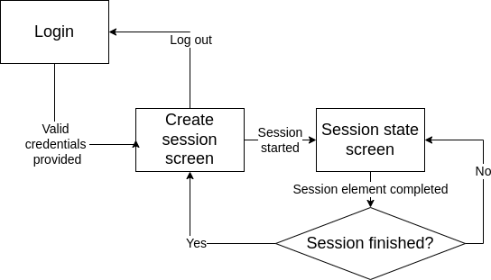
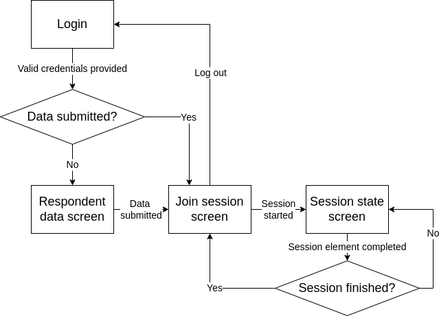

# Japanese Food Survey Frontend

This is the frontend service to be used together with [Japanese Food Survey Backend](https://github.com/ito-tachibana/jst-backend.git).

## Running the Project

This project requires `NPM` (Node Package Manager) to be installed.
Installation instructions:
- `NPM`: [installation](https://docs.npmjs.com/downloading-and-installing-node-js-and-npm)

Running the project requires a running backend instance on port 8080 to connect to. Make sure it is started before connecting to the application.

Installing dependencies:
`npm install`

Running the project locally (runs on `localhost:3000` by default):
`npm start` 

## Deployment

This project is set up to be complied and deployed to the Heroku online hosting platform. Make sure you have [git](https://git-scm.com/download/) command-line utility installed.

To deploy the project, it must be connected to a running GitHub repository via the Heroku dashboard. Follow the instructions under the "Deploy" / "Heroku Git" tab.

Deploying the project:
- `git checkout master`
- `git push heroku master`
 
## Frontend interaction

Diagrams made with [draw.io](http://draw.io) - use it to open a diagram image file and modify the diagram.

### User log in

Users can log in and log out any number of times as long as the valid credentials are provided, but there can only be a single
active user session per user - logging in overwrites any older user sessions.

### Survey session flow

All users are required to be **logged in** before they can interact with a survey session. After logging-in, an administrator
must **create** a session and establish a websocket connection by **connecting** to it. All the session's respondents
need to then **connect** to it as well.

While all participants are connected to the session, the server communicates with each of them via websocket messages.
Users may lose connection to the server and reconnect to it without affecting the flow of the session. In case it happens, a pop-up message will appear and the user will be prompted to refresh the browser tab.

